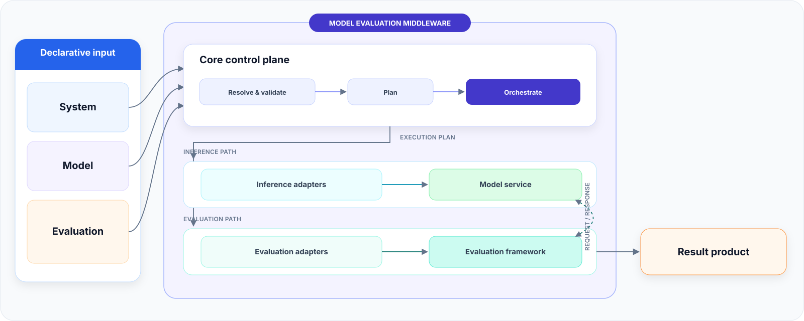

# Model Evaluation Middleware

[简体中文](docs/README.zh-CN.md)

A portable glue layer for model evaluation across hardware, inference engines,
models, datasets, and evaluation frameworks. It turns machine-specific runtime
details and reusable evaluation intent into one planned execution path and one
consistent result product.



## Start here

| Goal | Documentation |
|---|---|
| Install the project and finish a first real run | [Installation and first evaluation](docs/installation.md) |
| Understand System, Model, and Evaluation files | [Configuration overview](docs/configuration.md) |
| Configure hardware, inference, evaluation, or datasets | [Components and integrations](docs/components/index.md) |
| Register text, quantized, multimodal, or derived models | [Model guide](docs/models/index.md) |
| Inspect built-in support and validation status | [Compatibility matrix](docs/compatibility.md) |
| Consume JSON, Python, TXT, or SVG results | [Result product protocol](docs/result-product.md) |
| Add an external or built-in Adapter | [Adapter guide](docs/adapters/index.md) |

## Quickstart: Mock demo

The Mock path exercises the real configuration, planning, process, and result
pipeline on CPU without model files or an accelerator:

```bash
python -m pip install -e .
eval-manager demo --render-summary
```

It normally completes within 10 seconds and returns a JSON report containing
`contract_ok=1`. That value confirms middleware execution; it is not a model
quality score.

## Integration snapshot

The project is extended by adding named Adapters. This summary shows the current
built-in surface; `…` indicates that more integrations can be added without
changing Core.

| Layer | Built-in integrations |
|---|---|
| Hardware | CPU · NVIDIA GPU · Cambricon MLU · MetaX GPU · AMD GPU · Ascend NPU · … |
| Runtime | CPU · CUDA · Neuware · MACA · ROCm · CANN · … |
| Inference Backend | vLLM · OpenAI-compatible service · Ollama · llama.cpp · Reference Backend · … |
| Evaluator | lm-evaluation-harness · EvalScope · Reference Evaluator · … |
| Dataset / Binding | BBH local · local files · virtual dataset · lm-eval bindings · EvalScope binding · … |
| Model material | Hugging Face/local Safetensors · BF16/FP16 · quantized checkpoints · text/VL · derived artifacts · … |

Built-in means the Adapter and its contract are present. It does not by itself
mean that every combination has completed real-machine validation. The
[compatibility matrix](docs/compatibility.md) separates full E2E, smoke E2E,
and contract-tested support.

## What the middleware provides

| Capability | Product behavior |
|---|---|
| Portable configuration | Separates machine-owned System settings from reusable Model and Evaluation intent |
| Validation and planning | Resolves effective configuration, checks compatibility, and previews resources |
| Adapter orchestration | Connects devices, runtimes, environments, Backends, Datasets, Bindings, and Evaluators |
| Managed execution | Starts or attaches to services, evaluates, records, and cleans up owned processes |
| Consistent results | Publishes normalized metrics, native output, samples, effective config, versions, and logs |
| Reproduction support | Records the inputs and observable runtime context needed to reconstruct a run |

The middleware coordinates existing inference and evaluation systems; their
model loading, request semantics, benchmark definitions, and metric algorithms
remain authoritative. The project records reproducible experiments but does not
turn them into tamper-proof evidence.

## Validation coverage

| Level | Current exercised path |
|---|---|
| Full real-machine E2E | NVIDIA A100/CUDA and Cambricon MLU/Neuware with vLLM + lm-eval + full BBH |
| Real-machine smoke E2E | MetaX C500/MACA with vLLM-MetaX + lm-eval + BBH smoke |
| Mock E2E | CPU + Reference Backend/Evaluator + virtual Dataset |
| Contract-tested | EvalScope, AMD/ROCm, Ascend/CANN, Ollama, llama.cpp, generic OpenAI, and other built-ins |

Full environment records and commands are available for
[NVIDIA A100](docs/validation/nvidia-a100.md),
[Cambricon MLU](docs/validation/cambricon-mlu.md), and
[MetaX C500](docs/validation/metax-c500.md).

## First real evaluation

For a source checkout:

```bash
python -m pip install -e .
eval-manager schema-check
eval-manager adapters
```

Create a project skeleton, fill in its machine paths, and run the combined
read-only check before execution:

```bash
eval-manager init my-evaluation --hardware nvidia
cd my-evaluation

eval-manager check \
  --system-config config/system.yaml \
  --evaluation-config config/evaluation.yaml

eval-manager run \
  --system-config config/system.yaml \
  --evaluation-config config/evaluation.yaml \
  --render-summary
```

The [installation guide](docs/installation.md) continues from here with
Controller, inference environment, evaluation environment, hardware, model,
benchmark, execution, and result inspection.

## Three user configuration types

| File | Describes | Reusable scope |
|---|---|---|
| System | Hardware, Runtime, environments, Backend/Evaluator profiles, model root, cache, and results paths | One machine or deployment |
| Model | Model identity, source, architecture, format, quantization, context, and Backend loading parameters | Across machines |
| Evaluation | Selected models, benchmarks, profiles, seeds, limits, and one-run overrides | Across compatible machines |

```text
config/
├── systems/                 # Machine profiles
├── models/                  # Model catalog; may be grouped by provider/family
├── evaluations/             # Smoke, full, and one-off selections
├── system.yaml              # Generic init template
└── evaluation.yaml          # Generic init template
```

A System may register multiple named Backend and Evaluator environments. Every
Evaluation explicitly selects both profiles for one run; unused environments
remain inert. System hardware profiles expose device pools, while an Evaluation
may request a different device count for each model in a mixed-size batch.
See [configuration precedence](docs/configuration.md#selection-and-precedence).

## Common workflow

```bash
# Explain configuration or resource failures without starting the service
./eval-manager explain --system-config nvidia --evaluation-config smoke_bbh_08b

# Preview and save the resolved execution plan
./eval-manager plan --system-config nvidia --evaluation-config smoke_bbh_08b \
  -o /tmp/plan.json

# Execute and save optional TXT/SVG projections
./eval-manager run --system-config nvidia --evaluation-config smoke_bbh_08b \
  --render-summary

# Validate and inspect the final result product
./eval-manager result-check results/<run-id>
./eval-manager inspect results/<run-id>
```

`check` combines validation, Doctor, plan preview, and read-only resource
checks. `validate`, `doctor`, `plan`, and `explain` remain available separately.

For large matrices, export child plans for Slurm, Kubernetes, Ray, or an
internal scheduler. Core intentionally remains a single-host serial executor
with resource locks.

## Result product

Successful runs use the following default name:

```text
<platform>_<model-id>_<backend>_<benchmark-id>_YYMMDD-HHMM
```

```text
results/<run-id>/
├── result.json
├── metrics.json
├── terminal.json
├── raw/
├── samples/
├── config/
├── logs/
├── result-summary.txt       # Optional projection
└── result-summary.svg       # Optional projection
```

Failed runs add `failure.json`. Each public JSON document has an independent
Schema and is checked together with cross-file consistency rules. A complete
synthetic example is available under
[`examples/result_example/`](examples/result_example/), while the image below
is a sanitized real MLU full-BBH result.


Python consumers can use the same product boundary:

```python
from model_evaluation.results import load_run

run = load_run("results/<run-id>")
summary = run.metrics.summary()
tasks = run.metrics.tasks()
runtime = run.runtime()
artifacts = run.artifacts()
```

## Adapter extension

Seven Adapter kinds cover Device, Runtime, Environment, Backend, Dataset,
Binding, and Evaluator. Built-ins, development roots, and installed Python
entry points use the same versioned JSON-over-stdio contract.

Start with the [Adapter inventory](docs/adapters/index.md), then follow
[Adding an Adapter](docs/adapters/adding-an-adapter.md). The complete protocol
is defined in [Architecture and Adapter protocol](ARCHITECTURE_AND_ADAPTER_PROTOCOL.md).

## Repository layout

```text
model-evaluation-middleware/
├── model_evaluation/        # Installable package: Core, SDK, Schemas, Adapters
├── config/                  # User System, Model, and Evaluation files
├── docs/                    # Layered user, integration, and validation guides
├── examples/result_example/ # Synthetic final-result example
├── tests/                   # Unit, integration, and static-boundary tests
├── scripts/                 # Release and result-view automation
├── tools/                   # Standalone manual inspection/conversion tools
└── eval-manager             # Source-tree entry point
```

## Documentation map

- [Documentation index](docs/index.md)
- [Installation and first evaluation](docs/installation.md)
- [Configuration overview](docs/configuration.md)
- [Components and integrations](docs/components/index.md)
- [Model guide](docs/models/index.md)
- [Adapter guide](docs/adapters/index.md)
- [Result product protocol](docs/result-product.md)
- [Compatibility matrix](docs/compatibility.md)
- [Contributing](CONTRIBUTING.md), [security](SECURITY.md), and
  [changelog](CHANGELOG.md)
