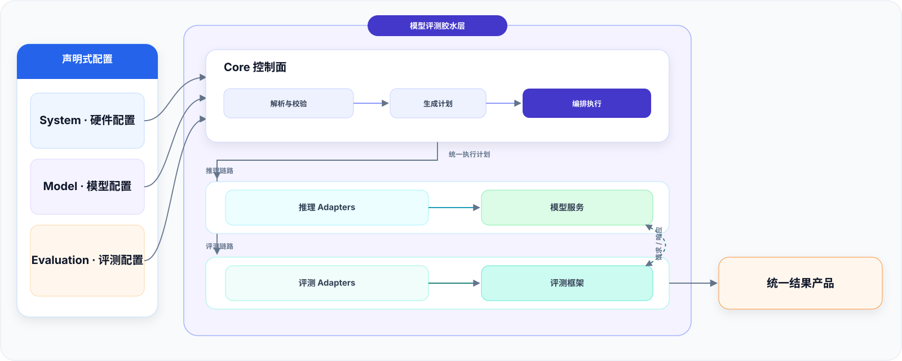
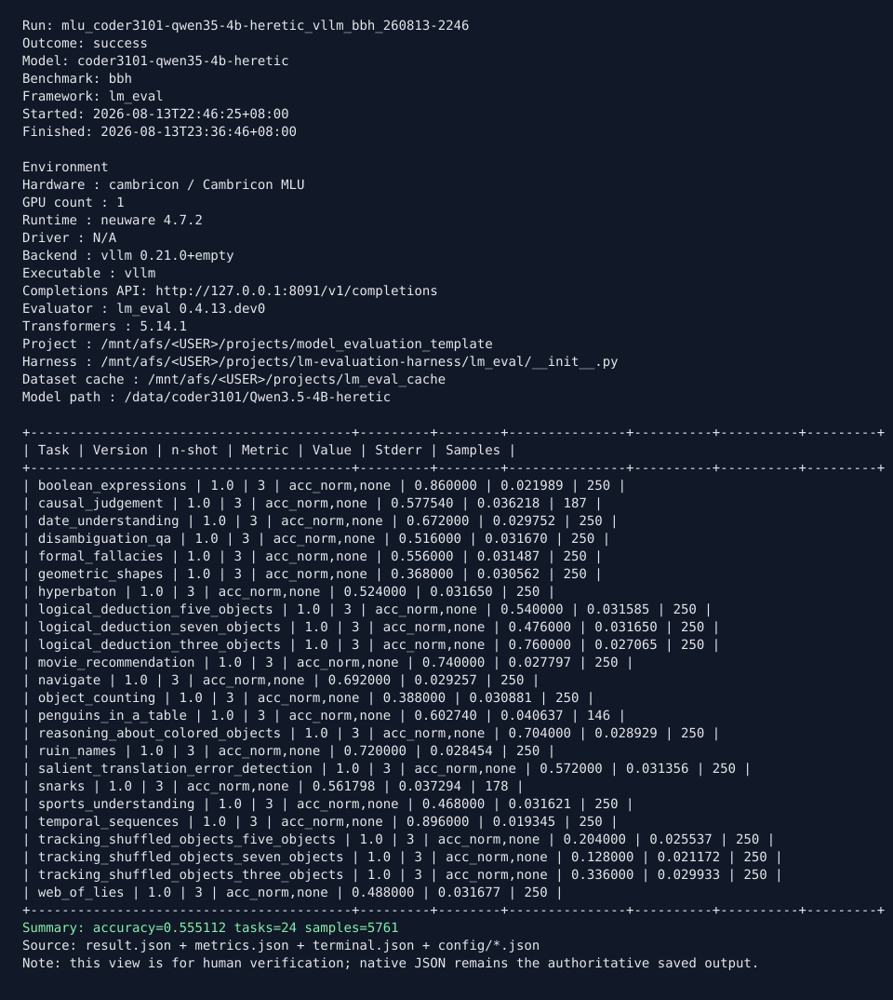

# Model Evaluation Middleware

[English](../README.md)

面向工程团队的模型评测胶水层：连接硬件、Runtime、推理框架、模型、数据集和评测框架，
把机器相关环境与可复用评测意图解析成统一执行计划，并输出一致的结果产品。



## 从这里开始

| 目标 | 文档 |
|---|---|
| 安装项目并完成第一次真实评测 | [安装与第一次评测](installation.md) |
| 理解 System、Model、Evaluation 三类配置 | [配置总览](configuration.md) |
| 查找 CLI 命令 | [CLI 命令索引](cli-reference.md) |
| 运行本地或外部调度 Matrix | [Matrix 完整执行链路](matrix-execution.md) |
| 列出、检查或迁移配置目录 | [配置目录管理](configuration/management.md) |
| 配置硬件、推理框架、评测框架或数据集 | [组件与集成](components/index.md) |
| 登记文本、量化、多模态或派生模型 | [模型指南](models/index.md) |
| 查看内置能力与实际验证状态 | [兼容性矩阵](compatibility.md) |
| 消费 JSON、Python、TXT 或 SVG 结果 | [结果产品协议](result-product.md) |
| 新增外部或内置 Adapter | [Adapter 指南](adapters/index.md) |

## 快速开始：Mock 演示

Mock 使用 CPU 和 Reference 组件运行真实配置、规划、进程和结果链路，不需要模型文件或
GPU/NPU：

```bash
python -m pip install -e .
eval-manager demo --render-summary
```

通常 10 秒内完成，并返回包含 `contract_ok=1` 的 JSON。该值表示中间件链路成功，不是
模型质量分数。

## 适配能力摘要

项目通过命名 Adapter 扩展。下表展示当前内置范围，`…` 表示后续可继续增加，而不需要
修改 Core：

| 层级 | 当前内置适配 |
|---|---|
| Hardware | CPU · NVIDIA GPU · Cambricon MLU · MetaX GPU · AMD GPU · Ascend NPU · … |
| Runtime | CPU · CUDA · Neuware · MACA · ROCm · CANN · … |
| 推理 Backend | vLLM · OpenAI-compatible service · Ollama · llama.cpp · Reference Backend · … |
| Evaluator | lm-evaluation-harness · EvalScope · Reference Evaluator · … |
| Dataset / Binding | BBH local · local files · virtual dataset · lm-eval bindings · EvalScope binding · … |
| 模型物料 | Hugging Face/本地 Safetensors · BF16/FP16 · 量化模型 · Text/VL · 派生物料 · … |

“内置”只说明 Adapter 与协议已经存在，不代表所有组合都完成了实机验证。
[兼容性矩阵](compatibility.md)会明确区分完整 E2E、实机 smoke 和 contract-tested。

## 项目提供什么

| 能力 | 行为 |
|---|---|
| 可移植配置 | 将机器相关 System 与可复用 Model、Evaluation 意图分离 |
| 校验与计划 | 解析有效配置、检查兼容性并预览资源 |
| Adapter 编排 | 连接 Device、Runtime、Environment、Backend、Dataset、Binding 和 Evaluator |
| 托管执行 | 启动或连接服务、执行评测并清理自己拥有的进程 |
| 统一结果 | 保存指标、框架原始输出、样本、有效配置、版本和日志 |
| 复现支持 | 记录重新构造运行所需的输入和可观测环境信息 |

中间件负责组织现有推理与评测系统；模型加载、请求语义、benchmark 定义和指标算法仍由
对应框架负责。项目记录可复现实验，但不把结果包装成防篡改证据。

## 当前验证范围

| 级别 | 已实际覆盖路径 |
|---|---|
| 完整实机 E2E | NVIDIA A100/CUDA、Cambricon MLU/Neuware；vLLM + lm-eval + 完整 BBH |
| 实机 smoke E2E | MetaX C500/MACA；vLLM-MetaX + lm-eval + BBH smoke |
| Mock E2E | CPU + Reference Backend/Evaluator + virtual Dataset |
| Contract-tested | EvalScope、AMD/ROCm、Ascend/CANN、Ollama、llama.cpp、generic OpenAI 等 |

详细环境与命令见 [NVIDIA A100](validation/nvidia-a100.md)、
[Cambricon MLU](validation/cambricon-mlu.md) 和
[MetaX C500](validation/metax-c500.md) 的脱敏记录。

## 第一次真实评测

源码目录安装：

```bash
python -m pip install -e .
eval-manager schema-check
eval-manager adapters
```

创建工程骨架、补全机器路径，运行只读检查后再执行：

```bash
eval-manager init my-evaluation --hardware nvidia
cd my-evaluation

eval-manager check \
  --system-config config/system.yaml \
  --evaluation-config config/evaluation.yaml

eval-manager run \
  --system-config config/system.yaml \
  --evaluation-config config/evaluation.yaml \
  --render-summary
```

[安装指南](installation.md)会继续说明 Controller、推理环境、评测环境、硬件、模型、
benchmark、执行与结果检查的完整流程。

## 三类用户配置

| 配置 | 描述内容 | 复用范围 |
|---|---|---|
| System | 硬件、Runtime、环境、Backend/Evaluator profile、模型根、缓存和结果路径 | 一台机器或一个部署 |
| Model | 模型身份、来源、架构、格式、量化、上下文和 Backend 加载参数 | 跨机器复用 |
| Evaluation | 本次模型、benchmark、profile、种子、limit 和临时覆盖 | 跨兼容机器复用 |

```text
config/
├── systems/                 # 机器配置
├── models/                  # 模型目录，可按提供方/模型族分级
├── evaluations/             # benchmark 与一次性选择
├── system.yaml              # init 通用模板
└── evaluation.yaml          # init 通用模板
```

一份 System 可以登记多个命名 Backend/Evaluator 环境。Evaluation 必须为每次运行显式选择
Backend 与 Evaluator；System 硬件 profile 提供设备池，Evaluation 可以按模型指定设备数量。
未选环境不会启动。详见[选择与覆盖规则](configuration.md#selection-and-precedence)。

## 常用工作流

```bash
# 不启动服务，解释配置或资源为何不可运行
./eval-manager explain --system-config config/system.yaml --evaluation-config config/evaluation.yaml --smoke

# 预览并保存执行计划
./eval-manager plan --system-config config/system.yaml --evaluation-config config/evaluation.yaml --smoke \
  -o /tmp/plan.json

# 执行并保存可选 TXT/SVG 投影
./eval-manager run --system-config config/system.yaml --evaluation-config config/evaluation.yaml --smoke \
  --render-summary

# 验证并查看最终结果
./eval-manager result-check results/<run-id>
./eval-manager inspect results/<run-id>
```

`--smoke` 会临时把所选 Evaluation 限制为每个任务 1 个样本，不会修改 YAML，
也不能作为完整测评分数。正式运行时去掉该开关。`check` 组合 validate、Doctor、
plan preview 和只读资源检查；也可以分别使用 `validate`、`doctor`、`plan` 和 `explain`。

配置目录可以独立检查，不会启动 Backend：

```bash
eval-manager config list
eval-manager config check
eval-manager config show evaluation teams/bbh
eval-manager config migrate                    # 默认仅预览
```

大规模 Matrix 可以导出子计划交给 Slurm、Kubernetes、Ray 或内部调度器。Core 保持
单机串行执行与资源锁，不扩张成分布式调度系统。导出协议 1.1 额外生成不含物理卡号的
逻辑 job 描述，先隔离不兼容的执行栈，再按声明的加速卡数量均衡分片：

```bash
eval-manager matrix-export /tmp/matrix-plan.json \
  -o /tmp/matrix-jobs --shards 8 --strategy resource_balanced
```

## 结果产品

成功运行默认命名：

```text
<platform>_<model-id>_<backend>_<benchmark-id>_YYMMDD-HHMM
```

```text
results/<run-id>/
├── result.json
├── metrics.json
├── terminal.json
├── raw/
├── samples/
├── config/
├── logs/
├── result-summary.txt       # 可选投影
└── result-summary.svg       # 可选投影
```

失败运行增加 `failure.json`。每个公共 JSON 都有独立 Schema，并执行跨文件一致性检查。
[`examples/result_example/`](../examples/result_example/) 提供完整合成示例；下图来自真实
MLU 完整 BBH 结果，只替换了用户目录。



Python 程序可通过同一产品边界读取：

```python
from model_evaluation.results import load_run

run = load_run("results/<run-id>")
summary = run.metrics.summary()
tasks = run.metrics.tasks()
runtime = run.runtime()
artifacts = run.artifacts()
```

## Adapter 扩展

七类 Adapter 分别覆盖 Device、Runtime、Environment、Backend、Dataset、Binding 和
Evaluator。内置目录、开发态 root 与 Python entry point 都使用同一套版本化
JSON-over-stdio 协议。

先查看 [Adapter 清单](adapters/index.md)，再按
[新增 Adapter](adapters/adding-an-adapter.md)操作。完整协议见
[架构与 Adapter 协议](../ARCHITECTURE_AND_ADAPTER_PROTOCOL.md)。

## 项目结构

```text
model-evaluation-middleware/
├── model_evaluation/        # Core、SDK、Schema 与 Adapter
├── config/                  # 用户 System、Model、Evaluation
├── docs/                    # 分层使用、集成与验证文档
├── examples/result_example/ # 合成结果产品示例
├── tests/                   # 单元、集成与静态边界测试
├── scripts/                 # 发布和结果视图自动化
├── tools/                   # 独立人工检查/转换工具
└── eval-manager             # 源码树入口
```

## 文档导航

- [文档索引](index.md)
- [安装与第一次评测](installation.md)
- [配置总览](configuration.md)
- [CLI 命令索引](cli-reference.md)
- [Matrix 完整执行链路](matrix-execution.md)
- [组件与集成](components/index.md)
- [模型指南](models/index.md)
- [Adapter 指南](adapters/index.md)
- [结果产品协议](result-product.md)
- [兼容性矩阵](compatibility.md)
- [贡献指南](../CONTRIBUTING.md)、[安全说明](../SECURITY.md)和
  [版本变化](../CHANGELOG.md)
